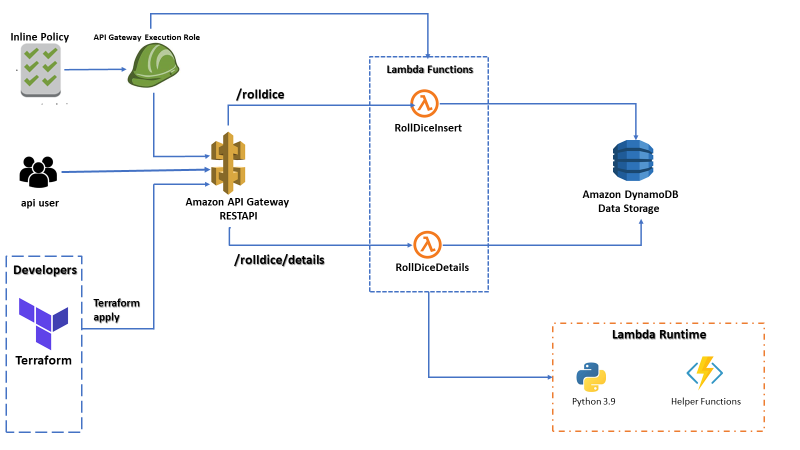

# Roll-Dice-Simulation

# Design Architecture

# Resources
1. AWS (API Gateway(REST API), Lambda Function, DynamoDB, IAM Role)
2. Terraform
3. Boto3 

# AWS
1. created DynamoDb named ROLL_DICE_SIMULATION
2. created IAM Assume Role for Lambda function execution and attached inline policy to allow DynamoDb resource actions
3. created two lambda functions named RollDiceSumInsert and RollDiceDetails respectively
4. created REST API Gateway named Dice Distribution.
    a. [GET] [/rolldice] [Query Strings: totalrolls, sidesofdice, noofdice] will call RollDiceSumInsert lambda function
       and apply business logic, store data into DynamoDb
    b. [GET] [/rolldice/details] [Optional Query Strings: sidesofdice, noofdice] will call RollDiceDetails lambda function
       and apply business logic, return relative distribution

# Terraform
1. created terraform files to deploy the lambda function into AWS.

# Enhancements
1. monitor lambda functions using CloudWatch Logs/Metrics
2. need to create resource for API Gateway in Terraform

# REST
1. Using API Gateway(REST) publish and deploy the resources to trigger lambda function
2. Using Authentication(API Keys or Token based) and Authorization(Policies) we can secure our API.
3. Using CloudWatch or any third party tools like Prometheus we can monitor our lambda functions
4. using automated CI/CD pipeline with different stages and steps like build, code review and e.t.c we will test quality of the API  

# DEMO URLS TO TEST(API Deployed at develop stage)
 
 Case1: 
 Simulation Total Insert
 https://jp23513onj.execute-api.us-east-1.amazonaws.com/develop/rolldice?noofdice=1&sidesofdice=6&totalrolls=200
 
 Case2:
 get relative distribution by dice no- dice side combination
 https://jp23513onj.execute-api.us-east-1.amazonaws.com/develop/rolldice/details?noofdice=1&sidesofdice=6
 
 get total simulation and total rolls group by all dice no- dice side combination
 https://jp23513onj.execute-api.us-east-1.amazonaws.com/develop/rolldice/details
 
 